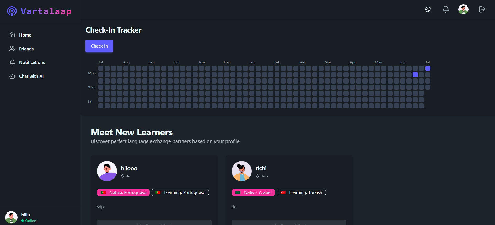
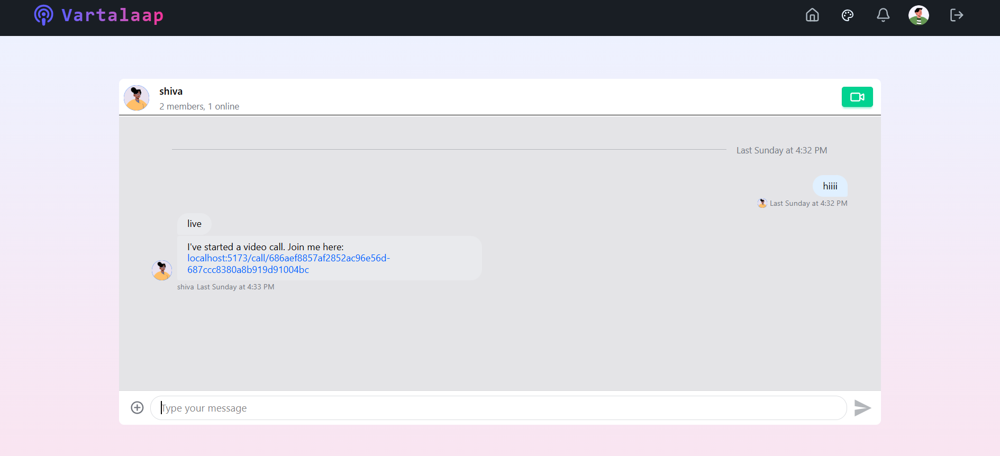

#   Vartalaap - Language Learning Platform


## 🔍 Overview

**Varta** is a language learning platform where users can learn new languages by directly interacting with native speakers via video calls or real-time chat. Instead of traditional learning through courses, Varta emphasizes real-world practice and conversation.

<table width="1000" align="center">
<tr align="center">
<td> Streak  </td>
<td> Chats  </td>
</tr>
</table>

## ✨ Features

- 🤖 AI Powered Interaction
- 💬 Real-Time Chat
- 📹 Video Calling with Friends
- 🎨 32+ Customizable Themes
- 🔥 Daily Streak Check-In System
- 🔐 JWT Authentication

## 🛠️ Tech Stack

- [Stream](https://getstream.io/) - Video Calling and Chat Integration
- [MongoDB](https://www.mongodb.com/) - NoSQL Database
- [Express.js](https://expressjs.com/) - Backend Framework
- [React.js](https://react.dev/) - Frontend Library
- [Node.js](https://nodejs.org/en) - Runtime Environment
- [Zustand](https://zustand-demo.pmnd.rs/) - State Management
- [TanStack Query](https://tanstack.com/query/latest) - Data Fetching and Caching
- [Vite](https://vite.dev/) - Frontend Build Tool
- [TailwindCSS](https://tailwindcss.com/) - CSS Framework
- [DaisyUI](https://daisyui.com/) - TailwindCSS Components
- [Embla Carousel](https://www.embla-carousel.com/) - Carousel for UI
- [React Hot Toast](https://react-hot-toast.com/) - Toast Notifications
- [StorySet](https://storyset.com/) - Illustrations
- [Avatar Placeholder](https://avatar-placeholder.iran.liara.run/) - Random Avatars
- [Flagcdn](https://flagpedia.net/download/api) - All country flags

## ⚙️Installation & Setup

### Step 1: Clone the Repository

```bash
  git clone https://github.com/harshitsoni341/Vartalaap-Platform.git
```

### Step 2: Install Required Dependencies

```bash
#Frontend
cd frontend
npm install

#Backend
cd backend
npm install
```

### Step 3: Environment Variables
To run this project, you will need to add the following environment variables to your `.env` file

**Frontend `.env`:**

```env
VITE_STREAM_API_KEY= your_api_key
VITE_GEMINI_API_KEY= your_api_key
```
**Backend `.env`:**
```env
PORT=5001
MONGO_URI = Your_MongoDB_Atlas_Key

STREAM_API_KEY= your_api_key
STREAM_API_SECRET= Your_api_key

JWT_SECRET_KEY=Your_secret_key 

NODE_ENV=production
```

>[!TIP]
>JWT Secret Key can be generated using [OpenSSL](https://www.openssl.org/)
>```bash
> openssl rand -base64 32
># something like this will be generated: J4dmpcXQSPCE73+hPaxeOT2ekP6mpAALam8NWv/MS0A=
>``` 

### 4. Run Development Servers

```bash
# Frontend
cd frontend
npm run dev  # runs on port 5173

# Backend
cd backend
npm run dev  # runs on port 5001
```

Visit [http://localhost:5173](http://localhost:5173) in your browser.

## 🎨 Themes

Varta offers these 32 themes:

<div align="center">
  <table><tr><td>


  </td></tr></table>
</div>


## 🌍 Supported Languages

Learn and interact in a wide variety of languages!


 English  
 Spanish  
 French  
 German  
 Mandarin  
 Japanese  
 Korean  
 Hindi  
 Russian  
 Portuguese  
 Arabic  
 Italian  
 Turkish  
 Dutch  

## 🚀 Future Improvements

- Add a responsive streak graph to track daily activity.
- Introduce quizzes tailored to the user's chosen language.
- Add forget password option.
- Better UI/UX.


